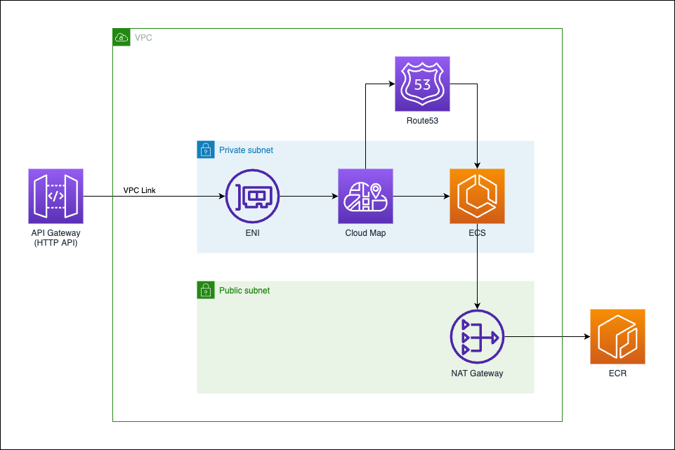

# zenn-fastapi-ecs-apigw

[](https://formulae.brew.sh/formula/aws-cdk)
[](https://nodejs.org/ja/)



# deploy step

## 1. create ECR repository in your AWS account

recommend ECR-private-repository-name is `zenn-example`.

## 2. build and push fastapi-image

```shell
$ make build-fastapi
$ make login
$ make push-fastapi tag=fastapi
```

## 3. create `infrastructure/params` from example-file

```shell
$ cd infrastructure
$ cp paramsExample.ts params.ts
```

## 4. edit `params.ts`

- before

```typescript
export const paramsEcsStack: IEcsStack = {
  ecs: {
    taskMemoryLimit: 512,
    taskCpu: 256,
    cloudMapNamespace: "example.com."
  },
  ecr: {
    fastapi: {
      name: "zenn-example",
      tag: "fastapi"
    }
  }
}

export const env: Environment = {
  account: "{your-aws-account}",
  region: "ap-northeast-1"
}
```

- after

```typescript
export const paramsEcsStack: IEcsStack = {
  ecs: {
    taskMemoryLimit: 512,
    taskCpu: 256,
    cloudMapNamespace: "any.domain.as.you.like.com."
  },
  ecr: {
    fastapi: {
      name: "zenn-example",
      tag: "fastapi"
    }
  }
}

export const env: Environment = {
  account: "000011112222",
  region: "ap-northeast-1"
}
```

## 5. deploy vpc, ecs, apigw

```shell
# in infra directory
$ cdk ls
zenn-example-vpc
zenn-example-ecs
zenn-example-apigw

$ cdk deploy zenn-example-vpc
$ cdk deploy zenn-example-ecs
$ cdk deploy zenn-example-apigw
```

## 6. check connection

```shell
$ curl -X GET https://{apigw-domain}/item
{"msg":"get-item"}

$ curl -X POST https://{apigw-domain}/item
{"msg":"post-item"}
```

# references

- [知れば納得！HTTP API と REST API の VPC リンクは違うんやで。](https://dev.classmethod.jp/articles/difference_between_rest_api_and_http_api_each_vpc_link/)
- [サービスディスカバリハンズオン！手を動かしてCloud Mapを理解する！！](https://dev.classmethod.jp/articles/cloudmap-handson-with-fargate/)
- [Configuring private integrations with Amazon API Gateway HTTP APIs](https://github.com/aws-samples/aws-apigw-http-api-private--integrations)
